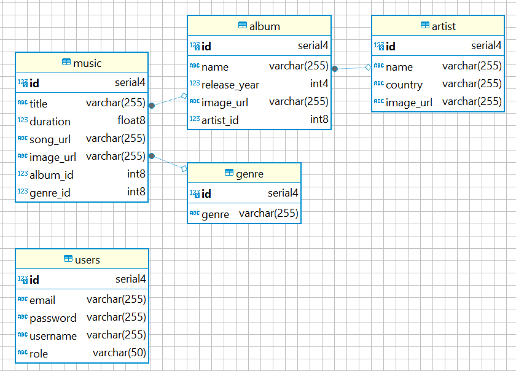

# Musicly

## Deskripsi
Musicly adalah sebuah aplikasi pemutar musik yang memberikan pengalaman seperti menggunakan Spotify. Aplikasi ini memungkinkan pengguna untuk mendengarkan musik dari berbagai genre, membuat playlist, serta menelusuri lagu-lagu dari artis dan album favorit. Musicly dibangun menggunakan **React** untuk frontend, **Java (Spring Boot)** untuk backend, dan **MariaDB** sebagai database. Aplikasi ini memiliki tampilan antarmuka yang mirip dengan desain modern aplikasi pemutar musik populer.

## ERD

## Fitur-Fitur

### Admin
- **Manajemen Artis, Album, Genre, dan Lagu**: Admin dapat mengelola data artis, album, genre, dan lagu melalui fitur CRUD (Create, Read, Update, Delete).
- **Fitur Pencarian**: Setiap manajemen (artis, album, genre, dan lagu) dilengkapi dengan fitur pencarian yang memudahkan admin untuk menemukan data.
- **Histori Aktivitas Pengguna**: Melacak siapa saja yang telah registrasi dan login ke dalam sistem.

### User
- **Pemutar Musik**: Pengguna dapat memutar lagu dengan format MP3 secara langsung dari aplikasi.
- **Genre Musik**: Menampilkan lagu-lagu yang dikategorikan berdasarkan genre, seperti R&B, Jazz, Pop, dan lainnya.
- **Artis**: Pengguna dapat menelusuri dan melihat daftar artis yang sudah ditambahkan oleh admin.
- **Album**: Pengguna dapat melihat album-album musik yang tersedia dan telah ditambahkan oleh admin.
- **Pencarian**: Memungkinkan pengguna untuk mencari lagu, album, atau artis dengan cepat dan mudah.
- **Autentikasi Pengguna**: Fitur login dan registrasi dengan token-based authentication untuk memastikan keamanan pengguna.

## Tech Stack
- **Frontend**: React.js & Tailwind CSS
- **Backend**: Java Spring Boot
- **Database**: MariaDB
- **DevOps**: -
- **Repository**: [Musicly on GitHub](https://github.com/sitifitriyani/Musicly)
